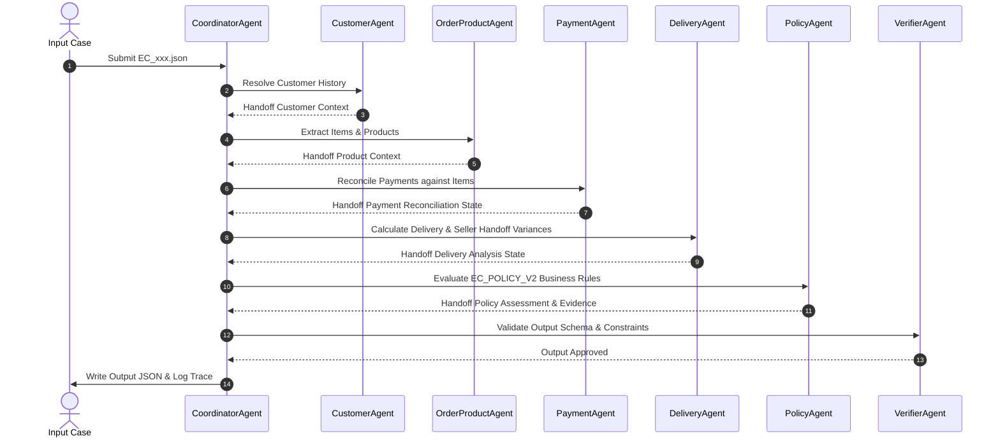

# Multi-Agent System Architecture — E-commerce Dispute Resolution

## 1. Executive Summary

Hệ thống **Multi-Agent E-commerce Dispute Resolution** được thiết kế để điều tra và xử lý tự động các yêu cầu khiếu nại thương mại điện tử từ dữ liệu Olist. Mô hình phân rã bài toán thành các Agent chuyên biệt theo từng miền thông tin (Domain-Specific Agents), tích hợp cơ chế trao đổi dữ liệu (handoff), xác minh đa tầng và ghi nhật ký trace minh bạch.

---

## 2. Agent Roles & Permissions Matrix

| Agent Name | Role & Domain | Data Access Scope | Input Contracts | Output Artifacts / State |
| :--- | :--- | :--- | :--- | :--- |
| **CoordinatorAgent** | Điều phối toàn hệ thống, nhận case, giao task, tổng hợp state, quản lý trace log | `input/EC_xxx.json`, `trace.jsonl` | Case Input JSON | `output/EC_xxx.json`, `trace.jsonl` |
| **CustomerAgent** | Phân tích định danh khách hàng & truy xuất lịch sử đơn hàng | `customers_df`, `orders_df` | `customer_id`, `claimed_order_id` | `customer_context` (`customer_unique_id`, `related_order_ids`) |
| **OrderProductAgent** | Kiểm tra chi tiết đơn hàng, danh mục sản phẩm, người bán (seller) | `order_items_df`, `products_df`, `sellers_df`, `category_translation` | `claimed_order_id` | `affected_entities`, `product_context`, Items breakdown |
| **PaymentAgent** | Tổng hợp dòng thanh toán, đối soát tổng tiền sản phẩm + cước phí | `order_payments_df` | `claimed_order_id`, `items` | `payment_reconciliation`, Payment IDs |
| **DeliveryAgent** | Phân tích mốc thời gian vận chuyển, tính độ lệch giao hàng & bàn giao seller | `orders_df`, `order_items_df` | `order` metadata, `items` | `delivery_analysis` |
| **PolicyAgent** | Áp dụng chính sách `EC_POLICY_V2`, phân loại primary/secondary issue, tính refund & actions | Rules Engine | Combined Agent States | `case_assessment`, `root_cause_analysis`, `evidence_ids`, `financial_resolution`, `resolution_actions` |
| **VerifierAgent** | Kiểm định ràng buộc schema, mảng tối đa, null handling & confidence | System Rules | Candidate Output JSON | Final Validated JSON |

---

## 3. Communication & State Handoff Flow

---

## 4. Business Rule Decision Tree (`EC_POLICY_V2`)

1. **Primary Issues Priority Hierarchy**:
   - `canceled_order_paid`: `order_status = canceled` AND `payment_total > 0` $\rightarrow$ Refund full payment, Party: `platform`.
   - `unavailable_order_paid`: `order_status = unavailable` AND `payment_total > 0` $\rightarrow$ Refund full payment, Party: `platform`.
   - `late_delivery_seller`: Giao trễ sau `estimated_date` AND có ít nhất 1 seller bàn giao muộn `shipping_limit_date` $\rightarrow$ Refund freight, Party: `seller`.
   - `late_delivery_logistics`: Giao trễ sau `estimated_date` AND không seller nào bàn giao muộn $\rightarrow$ Refund freight, Party: `logistics_provider`.
   - `valid_split_payment`: Có $\ge 2$ payment rows AND khớp tổng tiền item + freight (sai số $\le 0.10$ BRL) $\rightarrow$ Refund 0, Action: `explain_valid_split_payment`.
   - `unsupported_late_claim`: Giao không muộn hơn `estimated_date` AND payment khớp $\rightarrow$ Refund 0, Action: `reject_late_refund`.

2. **Secondary Issues Identification**:
   - `multi_item_order`: $\ge 2$ item rows.
   - `multi_seller_order`: $\ge 2$ distinct seller IDs.
   - `split_payment`: $\ge 2$ payment rows.
   - `repeat_customer`: $\ge 1$ related historical order.
   - `multiple_categories`: $\ge 2$ distinct product categories.

---

## 5. Traceability & Audit Logging

Mọi thao tác của hệ thống được ghi lại theo định dạng JSON Line trong `trace.jsonl` với cấu trúc:
- `timestamp`: Thời gian ISO thực hiện action.
- `case_id`: Mã case đang xử lý.
- `agent`: Tên Agent thực thi (CoordinatorAgent, CustomerAgent, ...).
- `action`: Tên hành động/bước handoff.
- `details`: Nội dung dữ liệu bàn giao (payload state).
